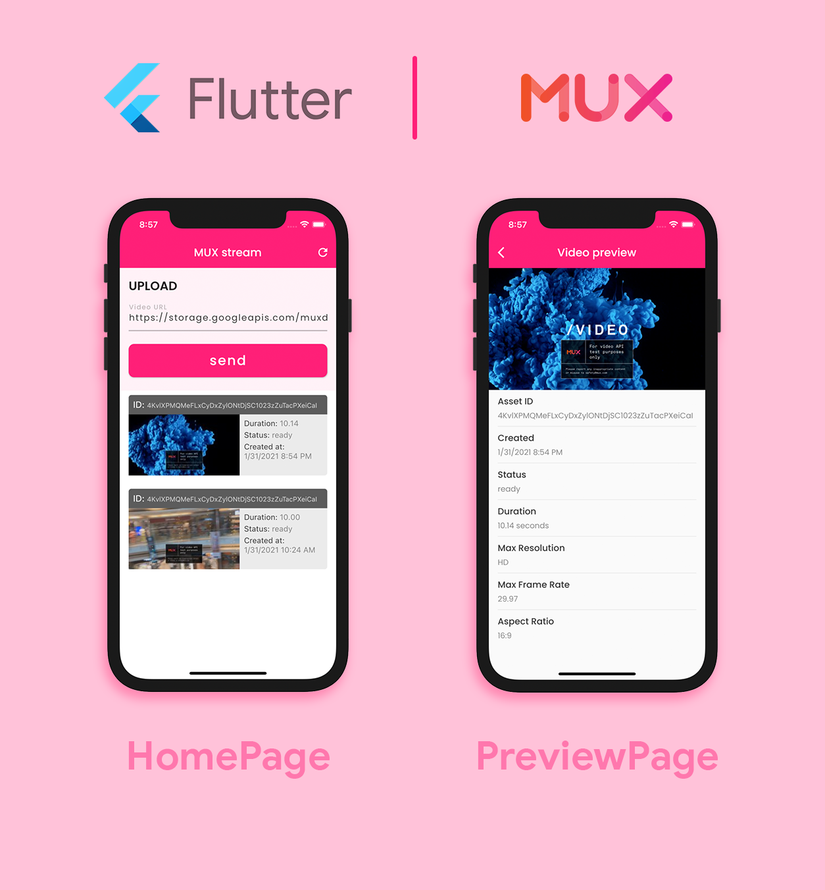
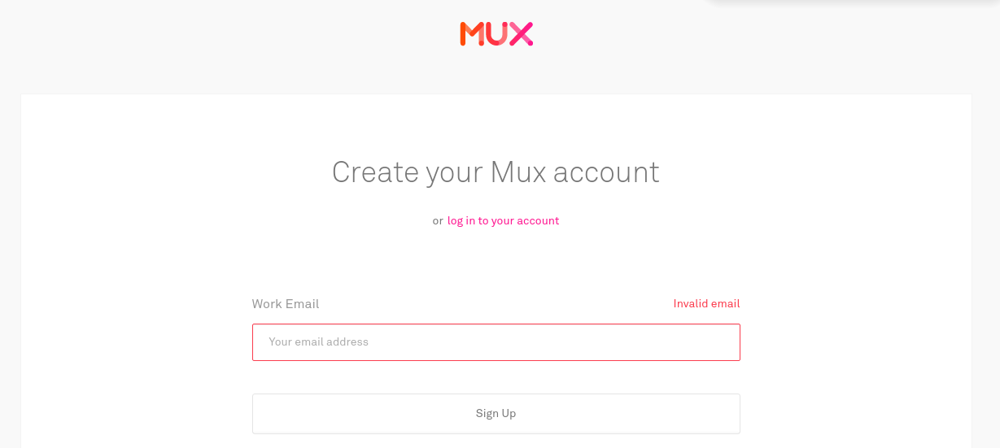
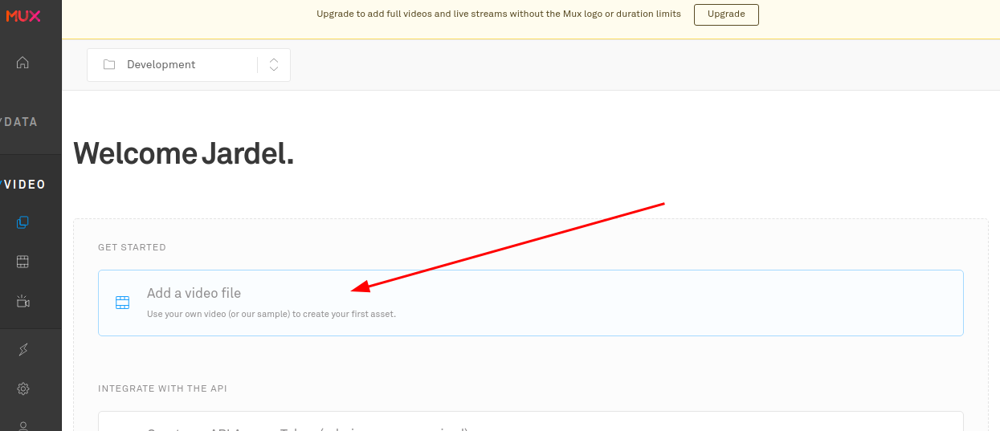
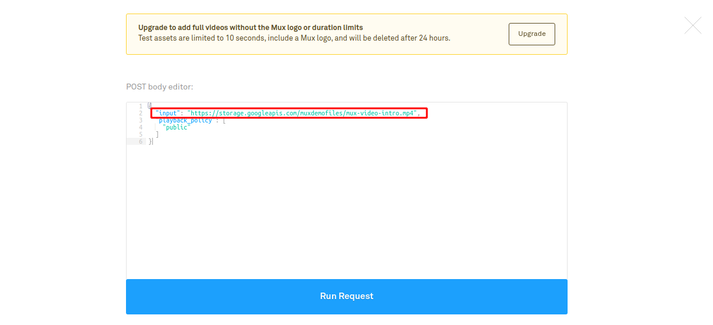
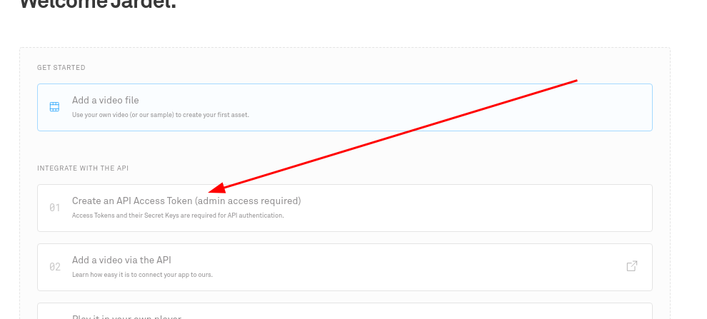
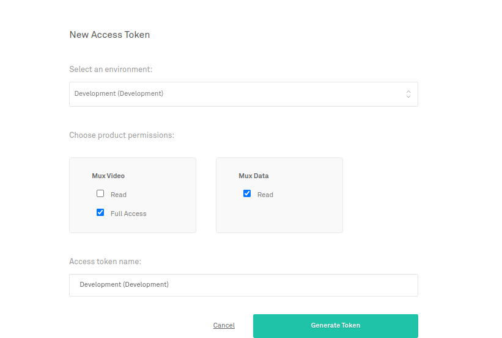
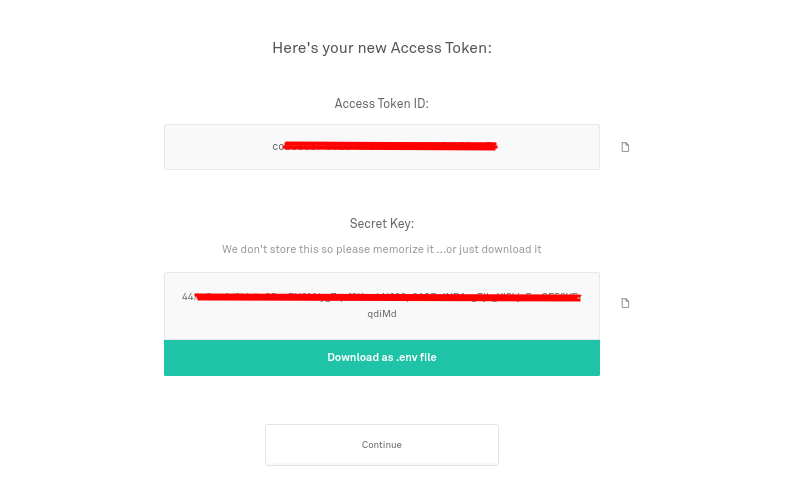

# Video Streaming App with Mux
a simple flutter application as a demonstration of the use of streaming videos using mux.

<div align="center">
  
</div>

This project was a step by step of this article [here](https://medium.com/flutter-community/integrating-video-streaming-with-flutter-using-mux-5ba707cca847);

## generating keys in the Mux
First you need to create a Mux account and you can do that by clicking [here](https://dashboard.mux.com/signup)

<div>
  
</div>

After creating the account you will be redirected to the dashboard and you can add a video url over there by clicking where the arrow indicates:
<div>
  
</div>

After clicking, you will see a screen similar to the screen below where you can add the url of a video file (it cannot be from youtube) or leave the default that will have an example video:
<div>
  
</div>

To be able to initialize the API and Mobile, we need to create the security keys in Mux, just access the home screen in Mux and click where the arrow indicates:
<div>
  
</div>

Once this is done, you will be redirected to a screen to generate the token as shown below.
<div>
  
</div>

Save this information well because we will use it in our project:
<div>
  
</div>

## configuring project
Com as chaves geradas é necessário adicioná-las ao projeto, veremos como fazer isso tanto na API como no Mobile respectivamente;

- API
  In the `server` directory there is a` .env.sample` file, you must rename it to only `.env` and add the MUX information
- Mobile
  In the root directory there is a `.env.sample` file, you must rename it to only` .env` and add the MUX information

## Run project
- Backend
Enter the `server` directory and run the command:
```
npm i && npm start
```

- mobile
run the command:
```
flutter run
```
